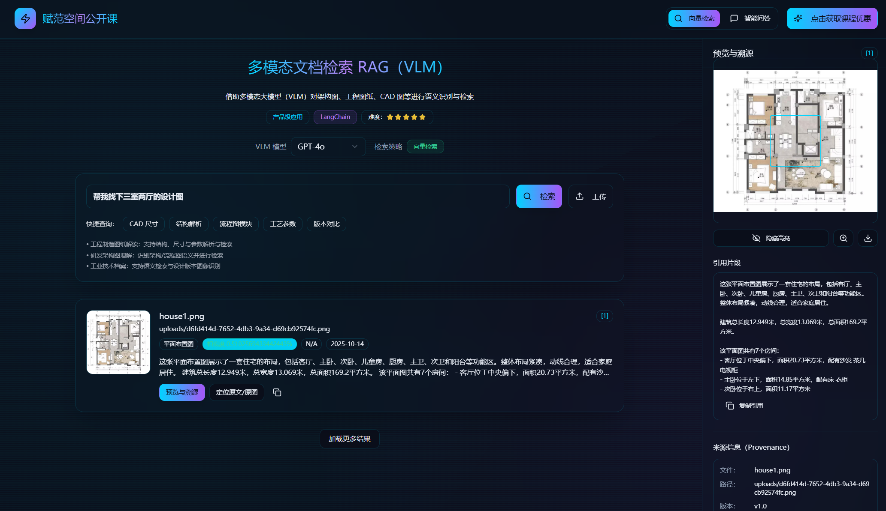

<div align="center">
  <h1>🚀Traceable Multimodal RAG Q&A System (Based on VLM)</h1>
  <p><em>A multimodal Q&A system based on Vision Language Models (VLM) that enables intelligent understanding and precise traceable Q&A for complex CAD drawings, architectural diagrams, and engineering drawings</em></p>
  <span><a href="./README_zh.md">中文</a> | English</span>
</div>


## ✨ Project Overview

This project is a **Traceable Multimodal RAG Q&A System** built with FastAPI backend + React frontend.

The project deeply integrates Vision Language Model (VLM) technology to achieve intelligent understanding -> precise retrieval -> traceable Q&A for complex CAD drawings, architectural diagrams, and engineering drawings.





## 🎬 Project Demo


https://github.com/user-attachments/assets/625ce3fb-ec22-4890-b921-1ed76ef3d46d


## 🎯 Core Features


- **VLM-Driven**: Integrates advanced Vision Language Models, breaking through traditional OCR limitations to deeply understand complex document semantics
- **Intelligent Q&A**: Context-aware Q&A based on RAG (Retrieval-Augmented Generation) architecture
- **Vector Retrieval**: Efficient semantic similarity retrieval using ChromaDB
- **Visualization & Interaction**: Provides intuitive frontend interface supporting file upload, querying, and result display


## 📚 System Architecture
The project adopts modular design with the following core modules:


| Layer | Tech Stack | Main Functions | Key Files |
|-------|-----------|----------------|-----------|
| **API Service Layer** | FastAPI + Pydantic | RESTful API, file upload, intelligent Q&A | `main_service.py` |
| **VLM Analysis Layer** | Multimodal LLM + Custom Prompts | Multimodal understanding, image analysis, structured extraction | `simple_vlm_analyzer.py` |
| **Vector Retrieval Layer** | ChromaDB + Qwen/HuggingFace Embeddings | Semantic retrieval, similarity computation | `qwen_embeddings.py` + ChromaDB |
| **Document Processing Layer** | PyMuPDF + PIL + Custom Parsers | PDF parsing, image preprocessing, format conversion | `unified_pdf_extraction_service.py` |
| **Data Storage Layer** | File System + Vector Database | Original file storage, vector indexing, metadata management | `uploads/` + `chroma_db/` |


## 🚀 Quick Start

### Requirements
- Python 3.11+
- Node.js 16+

### Configure Required API Keys

```bash
cp backend/.env.example backend/.env
```
Fill in the configuration items in the `backend/.env` file (API keys are required).
```
# Multimodal RAG Service Configuration

# VLM Model Configuration

VLM_MODEL_URL=https://api.openai.com/v1/
VLM_API_KEY=your-openai-api-key-here   # Required
VLM_MODEL_NAME=gpt-4o

# Service Configuration
SERVICE_HOST=0.0.0.0
SERVICE_PORT=8000

# Storage Configuration
UPLOAD_DIR=./uploads
PREVIEW_DIR=./previews
VECTOR_DB_DIR=./chroma_db

# Embedding Model Configuration
# Options: qwen or huggingface
EMBEDDING_TYPE=qwen

# Qwen Embedding Configuration (used when EMBEDDING_TYPE=qwen)
EMBEDDING_MODEL=text-embedding-v4
EMBEDDING_DIMENSIONS=1024
DASHSCOPE_API_KEY=your-dashscope-api-key-here   # Required
DASHSCOPE_BASE_URL=https://dashscope.aliyuncs.com/compatible-mode/v1

# HuggingFace Embedding Configuration (used when EMBEDDING_TYPE=huggingface)
# EMBEDDING_MODEL=sentence-transformers/paraphrase-multilingual-MiniLM-L12-v2
# EMBEDDING_MODEL=BAAI/bge-large-zh-v1.5

# Text Splitting Configuration
CHUNK_SIZE=800
CHUNK_OVERLAP=100
```

### One-Click Start (Recommended)

```bash
# Install dependencies
bash install.sh

# Start services
bash start.sh
```

### Manual Installation and Startup

#### Create and Activate Virtual Environment

```bash
uv venv .venv --python 3.11
source .venv/bin/activate

```

#### Install Dependencies

```bash
# Install backend dependencies
pip install -r backend/requirements.txt

# Install frontend dependencies
cd ./frontend
npm install
```
#### Start Frontend and Backend Services

```bash
# Start backend service
cd ./backend
python main_service.py
```
```bash
# Start frontend service
cd ./frontend
npm run dev
```


## 🙈 Contributing
We welcome contributions to the project through GitHub PR submissions or issues. We greatly appreciate any form of contribution, including feature improvements, bug fixes, or documentation optimization.

## 😎 Technical Communication
Explore our technical community 👉 [AI Tech Community | Normed Space](https://kq4b3vgg5b.feishu.cn/wiki/JuJSwfbwmiwvbqkiQ7LcN1N1nhd)

Scan to add our assistant, reply "VLM-RAG" to join the technical exchange group and learn with other developers.
<div align="center">

<div>
