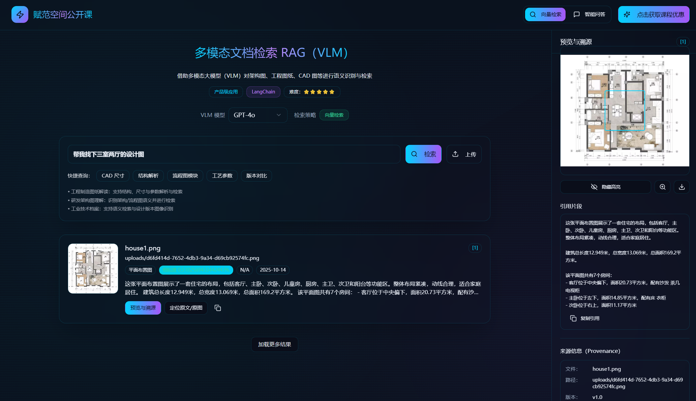

<div align="center">
  <h1>🚀可溯源多模态 RAG 问答系统（基于 VLM）</h1>
  <p><em>基于视觉语言模型（VLM）的多模态问答系统，实现对复杂CAD、架构图和工程图等内容的智能理解与精准溯源问答</em></p>
  <span>中文 | <a href="./README.md">English</a></span>
</div>


## ✨ 项目简介

本项目是一个**可溯源多模态 RAG 问答系统**。采用 FastAPI 后端 + React 前端。

项目深度融合视觉语言模型（VLM）技术，实现对复杂CAD、架构图和工程图等内容的智能理解->精准检索->溯源问答。





## 🎬 项目演示


https://github.com/user-attachments/assets/93eb35c7-a6a4-436e-976c-cc6808f5b238


## 🎯 核心功能


- **VLM 驱动**：集成先进的视觉语言模型，突破传统OCR局限，深度理解复杂文档语义
- **智能问答**：基于 RAG（检索增强生成）架构的上下文感知问答
- **向量检索**：采用 ChromaDB 实现高效的语义相似度检索
- **可视化与交互**：提供直观的前端界面，支持文件上传、查询与结果展示等


## 📚 系统架构
项目采用模块化设计，核心模块如下：


| 层级 | 技术栈 | 主要功能 | 关键文件 |
|-----|-------|----------|----------|
| **API服务层** | FastAPI + Pydantic | RESTful API、文件上传、智能问答 | `main_service.py` |
| **VLM分析层** | 多模态大模型 + 自定义提示词 | 多模态理解、图像分析、结构化提取 | `simple_vlm_analyzer.py` |
| **向量检索层** | ChromaDB + Qwen/HuggingFace Embeddings | 语义检索、相似度计算 | `qwen_embeddings.py` + ChromaDB |
| **文档处理层** | PyMuPDF + PIL + 自定义解析器 | PDF解析、图像预处理、格式转换 | `unified_pdf_extraction_service.py` |
| **数据存储层** | 文件系统 + 向量数据库 | 原文件存储、向量索引、元数据管理 | `uploads/` + `chroma_db/` |


## 🚀 快速开始

### 环境要求
- Python 3.11+
- Node.js 16+

### 配置必要 API-KEY

```bash
cp backend/.env.example backend/.env
```
填写 `backend/.env` 文件中的配置项（必填 API-KEY ）。
```
# 多模态 RAG 服务配置

# VLM 模型配置
VLM_MODEL_URL=https://aizex.top/v1
VLM_API_KEY=your-api-key-here
VLM_MODEL_NAME=gpt-4o

# 服务配置
SERVICE_HOST=0.0.0.0
SERVICE_PORT=8000

# 存储配置
UPLOAD_DIR=./uploads
PREVIEW_DIR=./previews
VECTOR_DB_DIR=./chroma_db

# Embedding 模型配置
# 选项: qwen 或 huggingface
EMBEDDING_TYPE=qwen

# 通义千问 Embedding 配置（当 EMBEDDING_TYPE=qwen 时使用）
EMBEDDING_MODEL=text-embedding-v4
EMBEDDING_DIMENSIONS=1024
DASHSCOPE_API_KEY=your-dashscope-api-key-here
DASHSCOPE_BASE_URL=https://dashscope.aliyuncs.com/compatible-mode/v1

# HuggingFace Embedding 配置（当 EMBEDDING_TYPE=huggingface 时使用）
# EMBEDDING_MODEL=sentence-transformers/paraphrase-multilingual-MiniLM-L12-v2
# EMBEDDING_MODEL=BAAI/bge-large-zh-v1.5

# 文本分割配置
CHUNK_SIZE=800
CHUNK_OVERLAP=100

```

### 一键启动（推荐）

```bash
# 安装依赖
bash install.sh

# 启动服务
bash start.sh
```

### 手动安装并启动

#### 创建并激活虚拟环境

```bash
uv venv .venv --python 3.11
source .venv/bin/activate

```

#### 安装依赖

```bash
# 安装后端依赖
pip install -r backend/requirements.txt

# 安装前端依赖
cd ./frontend
npm install
```
#### 启动前后端服务

```bash
# 启动后端服务
cd ./backend
python main_service.py
```
```bash
# 启动前端服务
cd ./frontend
npm run dev
```
## 🙈 贡献
欢迎通过GitHub提交 PR 或者issues来对项目进行贡献。我们非常欢迎任何形式的贡献，包括功能改进、bug修复或是文档优化。

## 😎 技术交流
探索我们的技术社区 👉 [大模型技术社区丨赋范空间](https://kq4b3vgg5b.feishu.cn/wiki/JuJSwfbwmiwvbqkiQ7LcN1N1nhd)

扫描添加小可爱，回复“VLM-RAG”加入技术交流群，与其他小伙伴一起交流学习。
<div align="center">

<div>

